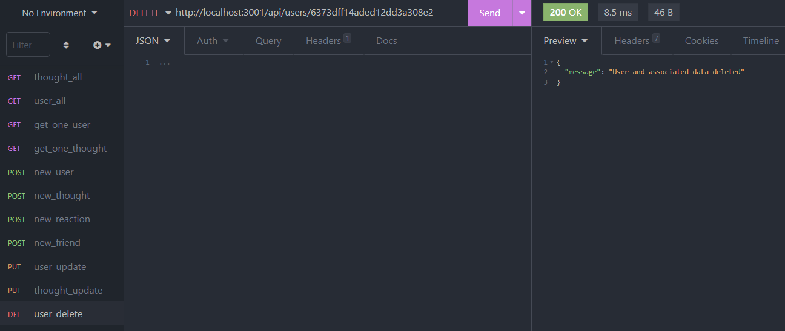

# Social Network API

## Description: In this application, a user such as an owner of a social media startup has a back end access to view, update, or delete data from a NoSQL database for a social media network website.

## After starting the application in terminal, the user can interface with the data through routes in Insomnia. The user can either view all social media users, all thoughts posted by the users, all reactions a thought post has, or the number of friends each user has. Users and thoughts can be deleted, updated, or added through insomnia, as well as reactions to thoughts and friends can be added or removed from users. Also, as a bonus, when a user is deleted, the user's associated data (thoughts, reactions, and friends) are also deleted.
---
### This application is initialized using command-line application, and access the employee database using NoSQL. The resulting data are displayed using Insomnia Core.

---
---

## 
## 
## 
## 
## 
---

## Table of Contents
  - [Installation](#installation)
  - [Usage](#usage)
  - [License](#license)
  - [Contributing](#contributing)
  - [Tests](#tests)
  - [Questions](#questions)

---
## Installation

A user can clone the files found in this repo then install the required node packages by running `npm i` in the command-line application. Next, run the command `npm start` in terminal and perform the requests (GET, PUT, POST, DELETE) on the appropriate route in insomnia core.

## Usage

In terminal and after installing the necessary node packages, open Insomnia Core and perform the different possible requests on one of the routes. For additional information, please reference the video linked below.

[Walkthrough Video](https://drive.google.com/file/d/1I_tMEcHCIaOIrcAqT6YjGZqwMm3My5rB/view?usp=sharing)

## License

This application is unlicensed

## Contributing

Visit my GitHub or Send me an email

## Tests

There are no tests written at this time

---
## Questions

If you have any questions, please visit my GitHub or send me an email.

[GitHub Link](https://github.com/momaki9)

[Email Me!](mailto:mostafa_m9@yahoo.com)